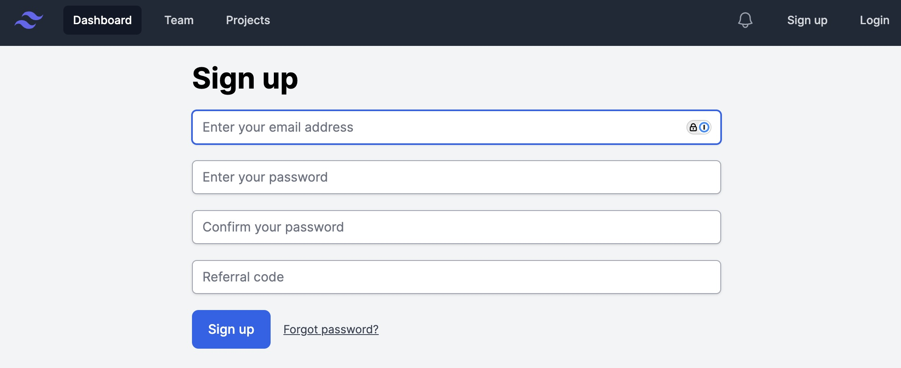
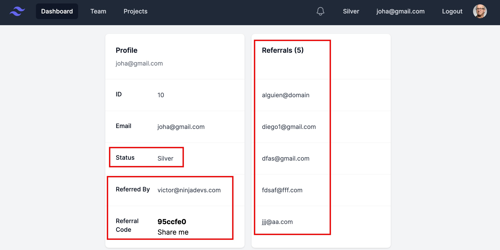

# Referral App

## Description

Ruby on Rails Testing Exercise (Referral System)


## Installation

1. Clone the repository:
    ```sh
    git clone git@github.com:vhsalazar/referral.git
    ```
2. Navigate to the project directory:
    ```sh
    cd referral
    ```
3. Install the required gems:
    ```sh
    bundle install
    ```
4. Set up the database:
    ```sh
    rails db:create
    rails db:migrate
    ```

## Usage

1. Start the Rails server:
    ```sh
    foreman start -f ./Procfile.dev
    ```
2. Open your web browser and go to `http://localhost:5000`.

## Running Tests

To run the test suite, use the following command:
```sh
bundle exec rspec
```

```
UserRegistrations
  User visits the registration page
  User registers with valid details
  User registers with invalid details
    when email address is invalid
    when referer code is invalid
    when password is blank
    when password and password confirmation do not match
    when referer code does not exist
  when referer code is passed as a query string
    it populates the referer code field

User
  associations
    belongs to referred_by (User)
    has many referrals (User)
    has many sessions
  validations
    email_address
      is expected to validate that :email_address cannot be empty/falsy
      is expected to allow :email_address to be ‹"somebody@domain.com"›
      is expected not to allow :email_address to be ‹"somebody.domain.com"›
      is expected to validate that :email_address is case-insensitively unique
  referral_code
    when creating a new user
      generates a referral_code
    when the referralc_code already exists
      does not allow duplicates
  referer_code
    is invalid if referer_code does not exist
    is valid if referer_code exists

Users::SignupUserService
  #call
    when user params are valid
      creates a new user
      returns true
    when user params are invalid
      does not create a new user
      returns false
    when referer_code is present
      sets the referrer
      handles referral status
    when referer_code is not present
      does not set the referrer
      does not handle referral status

Users::UpdateStatusService
  #call
    when the user has 0 to 4 referrals
      updates the status to bronze
    when the user has 5 to 9 referrals
      updates the status to silver
    when the user has 10 to 19 referrals
      updates the status to gold
    when the user has 20 or more referrals
      updates the status to platinum

Finished in 4.89 seconds (files took 0.67135 seconds to load)
31 examples, 0 failures
```

## Screenshots


